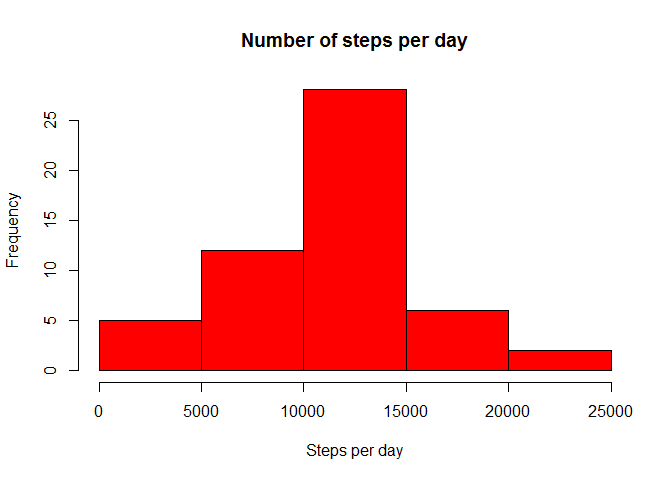
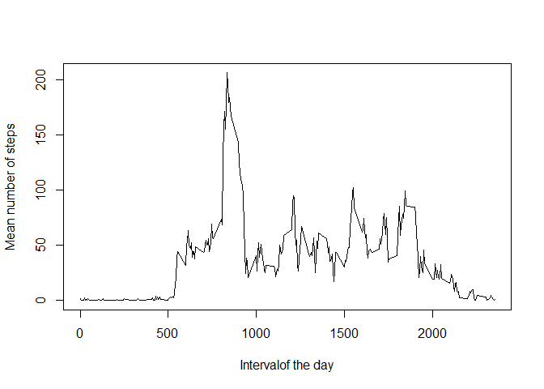
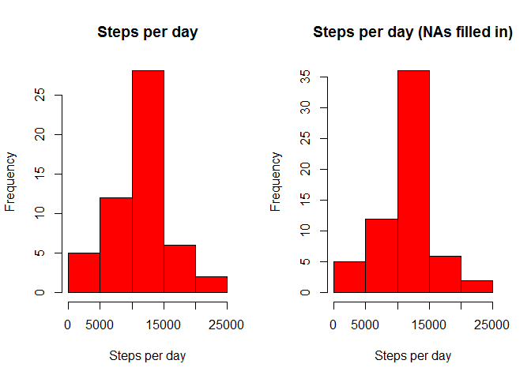
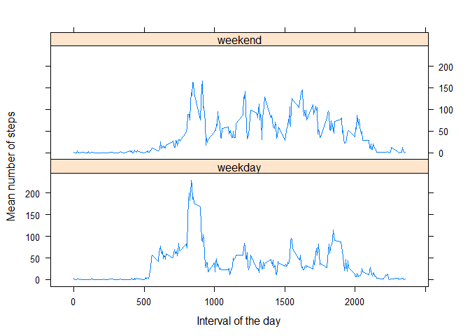

# Reproducible Research: Peer Assessment 1


## Loading and preprocessing the data


```r
# unzip the input data file
unzip("activity.zip", overwrite = TRUE, exdir = ".")

# load the input data file
activityData <- read.csv("activity.csv")
##activityData$date <- strptime(as.character(activityData$date), "%Y-%m-%d")
```

## What is the mean total number of steps taken per day?


```r
# Calculate the total number of steps taken per day (ignoring NAs)
aggregatedData <- aggregate(steps~date, data=activityData, FUN="sum", na.action = na.omit)

# Histogram of the total number of steps taken per day
with(aggregatedData, hist(steps, main = "Number of steps per day", xlab = "Steps per day", col="red"))
```

 

```r
# Report the mean and median of the total number of steps taken per day
mean(aggregatedData$steps)
```

```
## [1] 10766.19
```

```r
median(aggregatedData$steps)
```

```
## [1] 10765
```

## What is the average daily activity pattern?


```r
# calculate the mean of steps taken per 5 min inerval acros all days
aggregatedData2 <- aggregate(steps~interval, data=activityData, FUN="mean", na.action = na.omit)

# Plot the time series pattern of the mean steps taken per 5 min interval
with(aggregatedData2, plot(interval, steps, type = "l", ylab = "Mean number of steps", xlab ="Intervalof the day"))
```

 

```r
# Report which interval contains the maximum number of steps
maxStepsInterval <- which(aggregatedData2$steps == max(aggregatedData2$steps))
aggregatedData2[maxStepsInterval,]
```

```
##     interval    steps
## 104      835 206.1698
```

## Imputing missing values


```r
# Compute the number of rows with missing values
# First indices of rows with missing values
missingStepsValues <- which(is.na(activityData$steps))
# Second Compute the number of rows with missing values
length(missingStepsValues)
```

```
## [1] 2304
```

```r
# Create a new dataset with the NAs filled in with the mean of steps for that interval
modifActivityData <- activityData
for(i in missingStepsValues) {
  modifActivityData[i,"steps"] <- aggregatedData2[aggregatedData2$interval == modifActivityData[i, "interval"], "steps"]
}

# Calculate the total number of steps taken per day (ignoring NAs)
aggregatedData3 <- aggregate(steps~date, data=modifActivityData, FUN="sum")

# Histogram of the total number of steps taken per day
par(mfcol = c(1,2))

# Repeat previous histogram for comparison
with(aggregatedData, hist(steps, main = "Steps per day", xlab = "Steps per day", col="red"))

# Make a histogram of the steps taken per day (NAs filled in)
with(aggregatedData3, hist(steps, main = "Steps per day (NAs filled in)", xlab = "Steps per day", col="red"))
```

 

```r
# Report the mean and median of the total number of steps taken per day (the medians are equal now, the means were equal before the filling of NAs)
mean(aggregatedData3$steps)
```

```
## [1] 10766.19
```

```r
median(aggregatedData3$steps)
```

```
## [1] 10766.19
```

## Are there differences in activity patterns between weekdays and weekends?


```r
weekdayVar <- weekdays(strptime(activityData$date, "%Y-%m-%d"))
indicesWeekEnds <- which(weekdayVar == "Sunday" | weekdayVar == "Saturday")
indicesWeekdays <- which(weekdayVar != "Sunday" & weekdayVar != "Saturday")
weekdayVar[indicesWeekEnds] <- "weekend"
weekdayVar[indicesWeekdays] <- "weekday"
weekdayVar <- as.factor(weekdayVar)

modifActivityData2 <- cbind(modifActivityData, weekdayVar)
stepsWeekday <- modifActivityData2[weekdayVar == "weekday",]
stepsWeekend <- modifActivityData2[weekdayVar == "weekend",]
aggregatedData4 <- aggregate(steps~interval, data=stepsWeekday, FUN="mean")
aggregatedData5 <- aggregate(steps~interval, data=stepsWeekend, FUN="mean")

# Histogram of the total number of steps taken per day
par(mfcol = c(1,2))

# Repeat previous histogram for comparison
with(aggregatedData4, plot(interval, steps, type = "l", main = "Steps taken on weekdays", ylab = "Mean number of steps", xlab ="Interval of the day"))

# Make a histogram of the steps taken per day (NAs filled in)
with(aggregatedData5, plot(interval, steps, type = "l", main = "Steps taken on weekends", ylab = "Mean number of steps", xlab ="Intervalof the day"))
```

 
